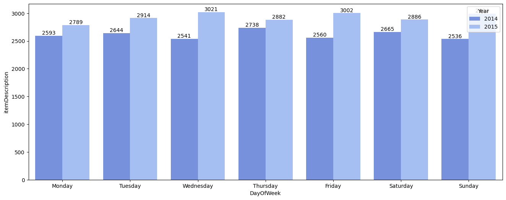
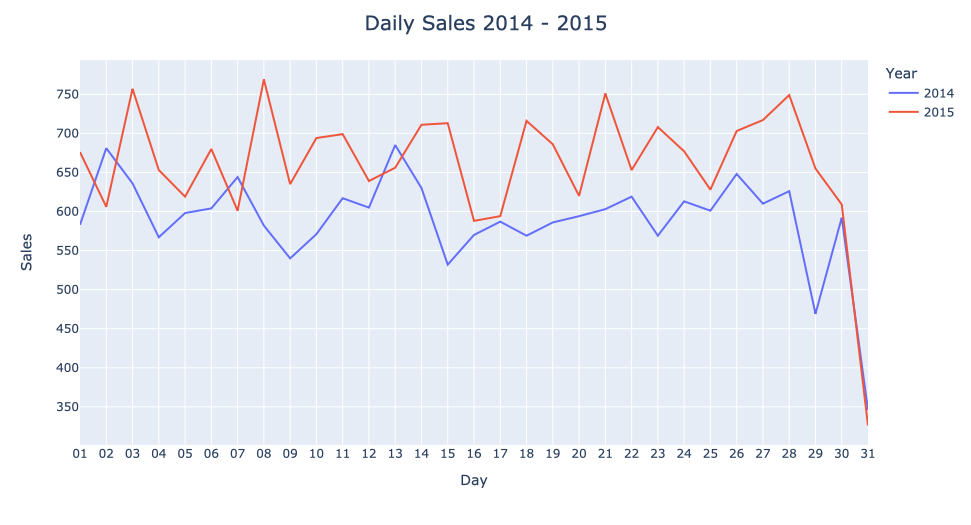
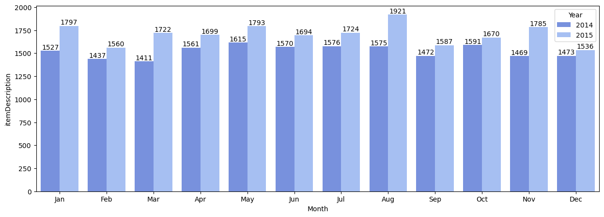

# market_analysis
Dataset source from Kaggle: https://www.kaggle.com/datasets/heeraldedhia/groceries-dataset

# Overview
Groceries market is widely utilized by a diverse demographic due to its accessibility and competitive pricing, particularly catering to the mid to low-income segments. To enhance business profitability, the implementation of an effective recommendation system is crucial. Customers typically purchase only what they need, however, as an entrepreneur, the objective is to encourage increased spending to maximize profits.

In pursuit of this goal, we can conduct a comprehensive analysis of customer behavior based on the purchase history within the time frame of 2014-2015. The analysis will be segmented into two key components: Part 1 focuses on the Recommendation System and Part 2 delves into Market Basket Analysis.

## Data Description
| Field          | Description                                                    |
|----------------|----------------------------------------------------------------|
|Member_number   | Unique identifier for distinguishing customers; this data will be used to observe and measure the success of market applications.                        |
|Date            | The date of purchases                                          |
|itemDescription | Description of the items they bought previously                |

- Rows: 38765
- Columns: 3
- Null values: 0

## Analysis Approach
Utilizing Association Rules to research relationships between items in dataset. The main purposes is to identify patterns or associations between variable in dataset. Association rules require the following:
- Support - Measures frequency of an item appears in the data.
- Confidence - Indicates how often if-then stateman are true.
- Lift - Compares real confidence with the predicted confidence.

## Exploratory Data Analysis
### Frequencies Items Sold

The graph illustrates the 30 items with the highest purchasing frequency in the groceries market.

### Time Series
#### Day of Week

#### Months

#### Years

![
